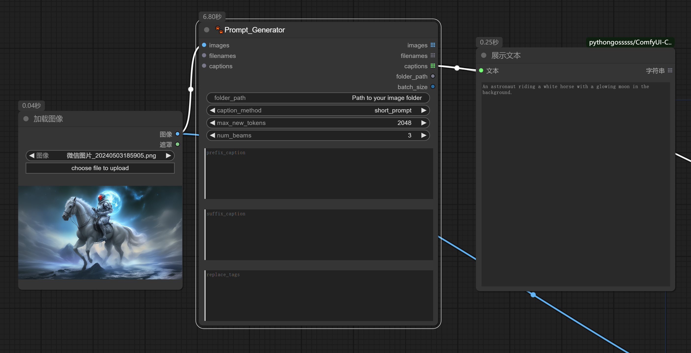
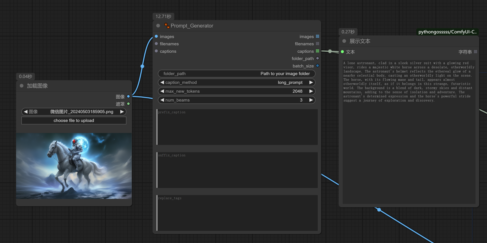

# Comfyui_MiniCPMv2_6-prompt-generator
This comfyui node can automatic generate image label or prompt for running lora or dreambooth training on flux series models by fine-tuned model: [MiniCPMv2_6-prompt-generator](https://huggingface.co/pzc163/MiniCPMv2_6-prompt-generator)

Above model fine-tuning based on int4 quantized version of [MiniCPM-V 2.6](https://huggingface.co/openbmb/MiniCPM-V-2_6). The fine-tuned model is trained on a midjourney prompt dataset and is trained with 2x 4090 24GB GPUs. this model is trained with more than 3000 samples which contain images and prompts source from Midjourney.The model can generate short prompts and long prompts for images with natural language style. It can be used for making image labels when lora training. Running with int4 version would use lower GPU memory (about 7GB).

------

#### Basic workflow for Image caption or Prompt gererate

- **Single-Image Caption**: Users can submit single image to generating caption. upload a image and set the **caption_method** to  "caption", the resulting in a caption such as below:

  

  

- **Short prompt generate:** Users can upload a image to generating short prompt. To upload a image and set the **caption_method** to  "short_prompt ", the resulting in text output as prompt like below:

  

- **Long prompt generate:** Users can upload a image to generating long prompt. To upload a image and set the **caption_method** to  "long_prompt ", the resulting in text output as prompt like below:

  

- Image regenerate: Users can pass the generated prompt to CLIP node as text input to regenerate image through t2i model by you like. sample workflow as below:

  


#### Batch image caption:

 For batch images caption, User can indicate the image folder path, system will read all images in the folder and put generated caption of the image as text file by the same as image's file name, the example workflow under the workflow folder as below:


### Installation

------

- Install from [ComfyUI Manager](https://github.com/ltdrdata/ComfyUI-Manager) (search for `MiniCPMv2_6-prompt-generator`)

- Download or git clone this repository into the `ComfyUI\custom_nodes\` directory and run:

```python
pip install -r requirements.txt
```

- Start ComfyUI interface to inference the workfolw.

  

### Model Download

------

The models will be downloaded automatically when running the workflow if they are not found in the `ComfyUI\models\LLM\` directory.

You can download the [MiniCPMv2_6-prompt-generator](https://huggingface.co/pzc163/MiniCPMv2_6-prompt-generator) model manually follow the link.
